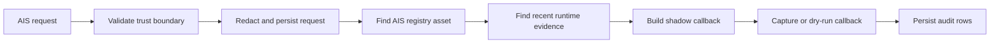
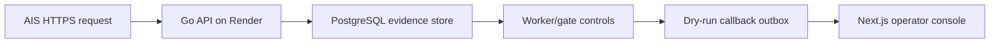
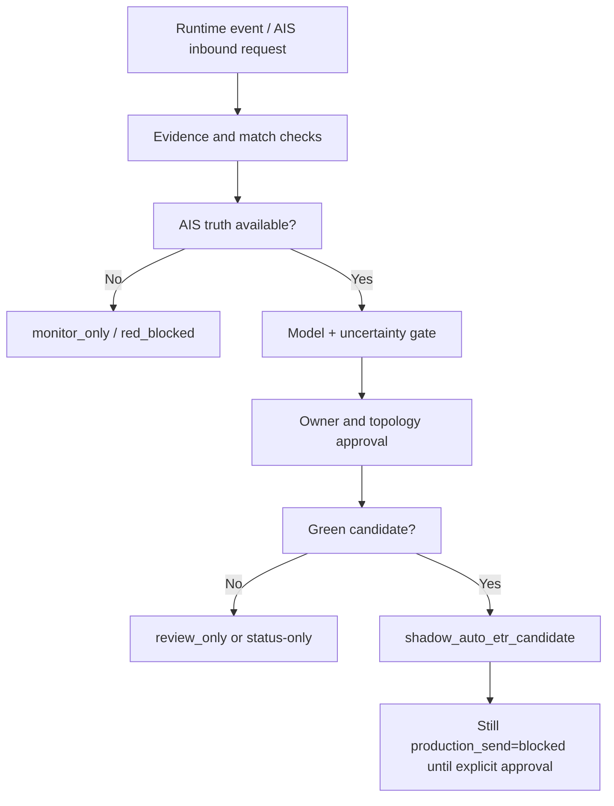

# Architecture And Flows

## Main Layers

| Layer | Path | Purpose |
| --- | --- | --- |
| Python shadow core | `ais_etr/` | Webex, parser, matcher, model, notifications, truth import, reports, gates. |
| Runtime evidence | `runtime/ais_etr.sqlite` plus CSV/MD outputs | Queryable local pilot state and audit outputs. |
| Input data exports | root XLSX/CSV files and `data/` | AIS registry, ETR history, ReportPO, GIS distance, Webex samples. |
| AIS inbound local API | `ais_etr/ais_inbound.py` | Shadow request/response processing for AIS outage verification. |
| Production-path API | `apps/api-go/` | Go API with PostgreSQL storage, metrics, send-control policy. |
| Operator console | `apps/web-next/` | Next.js console/demo view, uses live API when configured and demo fallback otherwise. |
| Cloud deployment | `render.yaml`, `runtime/cloud_pilot/` | Render API/web/Postgres package, runbooks, gate packets. |
| Governance/evidence packs | `runtime/*.md`, `runtime/cloud_pilot/*.md` | Readiness gates, owner queues, daily QA, production approval evidence. |

## Local Webex Shadow Flow

```mermaid
flowchart LR
    A["Webex message/export"] --> B["Store webex_messages"]
    B --> C["parse_webex_message"]
    C --> D["Store outage_events"]
    D --> E["ProtectionMatcher"]
    E --> F["EtrPredictor"]
    F --> G["Store predictions"]
    G --> H["build_notification_payload"]
    H --> I["ShadowNotifier"]
    I --> J["Store notifications"]
```

Key code:

- `ais_etr/pipeline.py`: orchestration.
- `ais_etr/parser.py`: device, feeder, event time, district, Webex device state.
- `ais_etr/matcher.py`: CB -> Recloser -> Switch -> Transformer -> Feeder fallback.
- `ais_etr/model.py`: dependency-light quantile baseline.
- `ais_etr/notifier.py`: shadow-only notification payload and mock webhook post/capture.

## AIS Inbound Verification Flow

Key code:

- `ais_etr/ais_inbound.py`: local/shadow request processor and HTTP server.
- `apps/api-go/internal/api/server.go`: production-path API endpoints.
- `apps/api-go/internal/storage/postgres.go`: PostgreSQL store.
- `apps/api-go/internal/sendcontrol/sendcontrol.go`: blocked/green-lane decision policy.

## Cloud Production-Path Flow

Current cloud package includes:

- Render services for API and web.
- Render Postgres.
- `PRODUCTION_SEND_MODE=blocked`.
- `CALLBACK_TRANSPORT=dry_run`.
- CI workflow for Python guardrails, Go tests, Next build, and sanitized export.

## Gate Flow

## Why The Architecture Is Conservative

The codebase deliberately favors CSV/SQLite/Markdown evidence and small CLI reports before services or dashboards. The production-path API and console exist, but they preserve the same core safety: shadow mode, blocked sends, durable evidence, and explicit gates.

