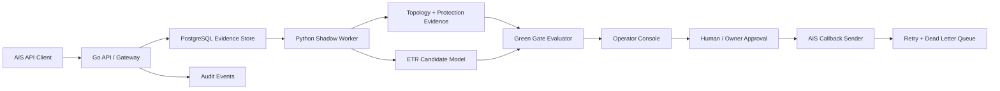

# Auto ETR Production Execution Plan

Generated: 2026-06-22  
Project: PEA API Intellisense / AIS ETR  
Target state: production-grade AIS integration with controlled `production_send`, starting from green-lane only.

## 1. Current Truth

| Lane | Current status | Meaning |
| --- | --- | --- |
| Cloud shadow endpoint | `GO` | AIS can send requests to the Render cloud API. API, Web Console, and PostgreSQL are running. |
| Real AIS cloud traffic | `WAITING_FOR_AIS` | Cloud `non_smoke_requests = 0`. Local/private inbound had previous real requests, but cloud still waits for first real AIS hit. |
| Production infrastructure | `PARTIAL` | Cloud runtime exists, but enterprise owner controls, monitoring, backup/restore, key rotation, retry/dead-letter, and approval records are still pending. |
| Auto ETR | `NO_GO` | Green rows = `0`; target is `>=30`. q50 MAE and q10-q90 coverage are not approved. |
| Production send | `blocked` | Correct current state. Do not change until gates below pass. |

Core non-negotiable rule:

```text
production_send remains blocked until BOTH production infrastructure gate and Auto ETR green gate pass with named owner approval.
```

## 2. Production Definition

This project should not jump directly from cloud pilot to full Auto ETR. Use staged production:

| Stage | External behavior | Internal send mode | Allowed before Auto ETR gate? |
| --- | --- | --- | --- |
| Stage 0: Cloud shadow | Receive AIS request, store evidence, show operator console | `blocked` | Yes |
| Stage 1: Human-reviewed callback | Operator approves status/ETR candidate before sending to AIS | `human_review_only` | Yes, after infra gate |
| Stage 2: Status-only automation | Auto-send safe status without customer-facing ETR minutes for approved cases | `status_only_green_lane` | Only after owner-approved policy |
| Stage 3: Green-lane Auto ETR | Auto-send ETR only for cases passing strict evidence/model gates | `auto_green_lane` | Yes, only after Auto ETR gate |
| Stage 4: Scale | Expand regions/customers/device types gradually | `auto_green_lane_scaled` | After monitored success |

## 3. Enterprise Architecture Target



Required principles:

- Go API remains trust boundary: auth, validation, idempotency, rate limit, redaction, durable writes.
- Python worker may calculate trace/evidence/ETR, but must stay append-only and auditable.
- PostgreSQL is source of operational truth for cloud pilot and production.
- Full meter/PEANO lookup must stay inside approved PEA secure runtime, not public logs or GitHub.
- AIS outage/restore remains customer-facing truth until AIS truth integration validates model quality.

## 4. Gate A: AIS Cloud Real-Traffic Gate

Goal: prove AIS can hit cloud endpoint reliably.

Required evidence:

- AIS sends at least:
  - 1 valid request
  - 1 duplicate `request_id`
  - 1 intentionally invalid auth test if AIS agrees
- PEA records only:
  - `request_id`
  - `received_at`
  - `status`
  - `callback_status`
  - `production_send`
- API response:
  - valid POST returns `202`
  - duplicate is idempotent and does not reprocess
  - invalid key returns `401`
  - bad timestamp/body returns safe `400`
- Web Console shows live data, not fallback demo.
- `production_send=blocked` remains true.

Exit decision:

```text
cloud_real_traffic_gate = PASS
```

## 5. Gate B: Production Infrastructure Gate

Goal: allow a production endpoint to run safely, even before Auto ETR is enabled.

Required controls:

- PEA-approved domain/gateway/auth policy.
- Secret management:
  - no API key in GitHub/chat/slides
  - key rotation drill passed
  - old key rejected after rotation
- Monitoring:
  - `/health` failure alert
  - database connection error alert
  - `401`, `400`, `429`, `5xx` spike alerts
  - callback failure alert
  - worker lag alert
- PostgreSQL:
  - scheduled backup
  - restore drill to non-production DB
  - retention policy
  - migration rollback plan
- Reliability:
  - retry queue
  - dead-letter queue
  - callback replay in dry-run mode
  - emergency kill switch
- Security/privacy:
  - redaction scan pass
  - no verbatim WebEx text, room id, token, full meter/PEANO, customer identity in public artifacts
- Owner approval record:
  - PEA API owner
  - AIS API owner
  - data owner
  - operations owner

Exit decision:

```text
production_infra_ready = GO
production_send_mode may move from blocked to human_review_only only after owner approval.
```

## 6. Gate C: Data + Model Green Gate

Goal: prove Auto ETR is accurate enough for a narrow green lane.

Current blocker:

- AIS truth metric rows: `79`
- Current green rows: `0`
- Minimum green rows target: `30`
- q50 MAE target: `<=16 min`
- q10-q90 coverage target: `0.75-0.90`

Why green rows are blocked:

- Need fresh AIS cloud pilot cases that can be matched from AIS request -> meter/topology -> protection evidence -> AIS outage/restore truth.
- Historical ETR timestamp must not be used as actual restoration truth.
- Feeder fallback must stay low-confidence / shadow-only unless topology owner approves.

Required work:

- Import AIS outage/restore truth into canonical table/file:
  - `runtime/ais_truth_latest.csv`
  - rejects into `runtime/ais_truth_rejects.csv`
- Match shadow events using precedence:
  - `event_number`
  - affected PEANO from payload
  - device + time
  - feeder + time as audit-only
- Build green subset policy:
  - confidence-eligible registry only
  - protection-level match preferred
  - evidence time delta within approved window
  - no `NO_METER`
  - no feeder-only auto send
  - no missing restore truth
- Evaluate:
  - q50 MAE
  - q10-q90 coverage
  - high-error rows
  - false positive / false negative review
  - manual override rate

Exit decision:

```text
auto_etr_ready = GO only when:
- green_rows >= 30
- green_q50_mae <= 16 minutes
- green_q10_q90_coverage between 0.75 and 0.90
- owner approval = approved
```

## 7. Production Send Design

Add explicit send-state machine before any callback is enabled:

```text
blocked
  -> human_review_only
  -> status_only_green_lane
  -> auto_green_lane
  -> emergency_off
```

Hard rules:

- Default is `blocked`.
- `emergency_off` overrides every mode.
- Auto send requires:
  - current gate snapshot passed
  - owner approval not expired
  - request matched green policy
  - callback endpoint allowlisted
  - duplicate-safe send idempotency key
  - audit event written before and after callback attempt
- Every send must write:
  - request_id
  - decision id
  - gate snapshot version
  - model version
  - callback status
  - retry count
  - redacted payload hash

Do not send:

- full meter/PEANO list
- verbatim WebEx text
- internal device evidence beyond approved contract
- ETR if evidence is feeder-only, missing truth, stale model, or gate expired

## 8. 30 / 60 / 90 Day Plan

### Days 0-14: Stabilize Cloud Shadow

- Get first AIS cloud real hit.
- Run duplicate/idempotency test with AIS.
- Configure Render alerts.
- Run privacy red-team scan after every release.
- Complete backup + restore drill.
- Complete key rotation drill after first AIS success.
- Add operator dashboard fields:
  - worker status
  - evidence stage
  - green candidate yes/no
  - reason blocked

Exit:

```text
cloud_real_traffic_gate = PASS
production_infra_ready = PARTIAL+
```

### Days 15-30: Connect Worker + Evidence Loop

- Connect cloud PostgreSQL pending rows to Python shadow worker.
- Append evidence traces and ETR candidates back to PostgreSQL.
- Add worker retry/dead-letter handling.
- Add dry-run callback sender but keep send disabled.
- Produce weekly green-gate report.
- Ask AIS for outage/restore truth feed format.

Exit:

```text
shadow_worker_ready = PASS
all worker outputs still production_send=blocked
```

### Days 31-60: Human-Reviewed Production Pilot

- Move to `human_review_only` only if infra gate passes.
- Operator reviews candidate responses before AIS callback.
- Send only approved pilot callbacks to AIS.
- Track:
  - callback success rate
  - operator override rate
  - evidence match rate
  - false confirmation count
  - model error after restore truth arrives
- Keep Auto ETR disabled.

Exit:

```text
human_review_production_pilot = PASS
green_rows collection >= 30 target in progress
```

### Days 61-90: Green-Lane Auto ETR Candidate

- Freeze green policy.
- Evaluate latest green subset.
- Run shadow replay for previous 30+ green cases.
- Run canary:
  - 1 district
  - 1 AIS priority site group
  - protection-level evidence only
  - no feeder-only auto send
- Enable `status_only_green_lane` before ETR minutes if owners require extra safety.
- Enable `auto_green_lane` only after model and owner gates pass.

Exit:

```text
auto_etr_ready = GO
production_send_mode = auto_green_lane for approved scope only
```

## 9. Teams / Sub-Agents Workstreams

| Workstream | Owner type | Deliverables |
| --- | --- | --- |
| Data + Model | Data science / analytics | AIS truth import, green subset builder, model evaluation, drift report |
| Backend API | Go engineer | send-state machine, callback sender, retry/DLQ, audit events |
| Worker | Python engineer | cloud worker, evidence trace, model candidate, failure-safe outputs |
| Infra/Security | DevOps / security | gateway/auth, secrets, alerts, backup/restore, key rotation |
| Ops/Product | PEA/AIS operation owner | runbook, operator console, training, approval workflow |
| Governance | Executive/data owner | production policy, allowed payload, owner sign-off, rollback authority |

## 10. Executive Ask

Ask for approval of 4 items:

1. Run AIS cloud shadow pilot with real traffic and AIS outage/restore truth feed.
2. Assign named PEA/AIS owners for API, data, operation, and production approval.
3. Approve production infrastructure hardening: gateway/auth, monitoring, backup/restore, retry/dead-letter, secret rotation.
4. Approve staged rollout policy: `human_review_only` first, then `status_only_green_lane`, then `auto_green_lane` after green gate.

## 11. Immediate Next Actions

1. Confirm AIS test window for cloud endpoint.
2. Capture first real cloud `request_id`.
3. Run backup/restore drill.
4. Configure Render alerts.
5. Build worker-to-Postgres shadow loop.
6. Define AIS outage/restore truth feed with AIS.
7. Build green subset report that explains exactly why each row is green/amber/red.
8. Add `production_send_mode` state machine and tests, but keep default `blocked`.

## 12. Kill Switch Policy

Production send must stop immediately if any of these happen:

- model gate fails or expires
- q50 MAE exceeds threshold on latest validated window
- q10-q90 coverage leaves target band
- duplicate request storm creates callback risk
- callback failures spike
- evidence parser regression appears
- AIS or PEA owner requests stop
- privacy scan detects forbidden content

Fallback state:

```text
production_send_mode = emergency_off
all outgoing callbacks disabled
shadow capture continues
```

## Source Files Reviewed

- `runtime/go_no_go_summary.md`
- `runtime/production_readiness_gate.md`
- `runtime/green_gate_tracker.md`
- `runtime/ais_inbound_model_demo_readiness.md`
- `runtime/cloud_pilot/production_evidence_tracker.md`
- `runtime/production_cloud_worker_handoff_contract.md`
- `runtime/cloud_pilot/incident_playbook.md`
- `runtime/cloud_pilot/key_rotation_drill.md`
- `runtime/render_cloud_shadow_deploy_status.json`
- `runtime/production_cloud_real_hit_status.json`
